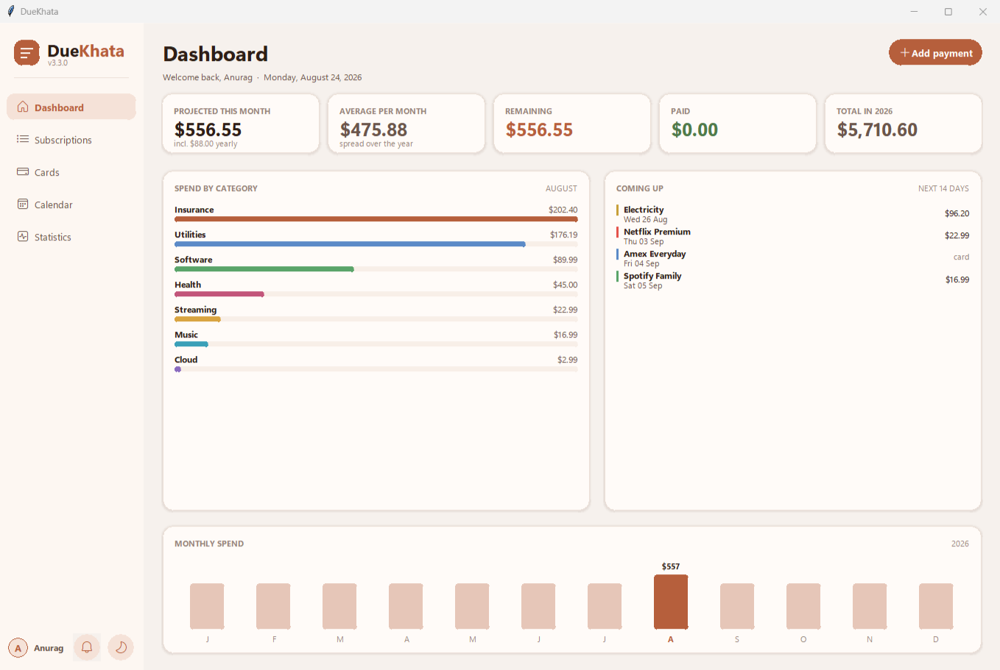
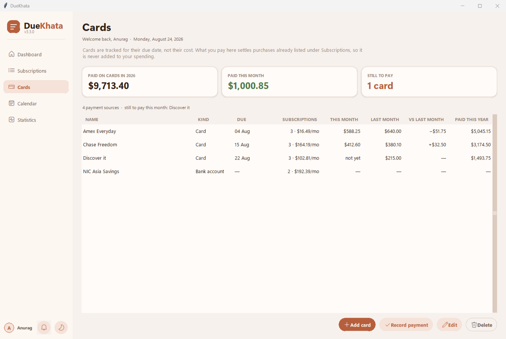

# DueKhata

[](https://github.com/paudel01anurag/duekhata-subscription-tracker/actions/workflows/tests.yml)
[](https://github.com/paudel01anurag/duekhata-subscription-tracker/blob/main/LICENSE)

A Windows desktop application for keeping track of recurring subscriptions and monthly bills. It
shows what is due, what has been paid, and what is still to leave your account this month.

## ⬇ Download the application

### **[Get DueKhata for Windows](https://github.com/paudel01anurag/duekhata-subscription-tracker/releases/latest)**

> **Do not use the green `Code` button at the top of this page.** That gives you the source code,
> which needs Python installed to do anything. The link above gives you the application itself.

**Nothing to install.** Under *Assets*, take **`DueKhata.exe`** and double-click it. Everything the
application needs is already inside that one file — Python included — so it runs on a computer that
has never had Python on it. Deleting the file removes it completely.

There is a ZIP there too, holding the same executable plus installation notes, if you would rather
have those.

Windows shows a blue **"Windows protected your PC"** box the first time. Click **More info**, then
**Run anyway**. That happens because the file is not signed with a paid certificate, not because
anything is wrong with it. Fuller notes are in [TESTERS.txt](TESTERS.txt).

Everything is stored locally. There is no account, no server, and no network access of any kind.



## Features

- Five views: a dashboard, a full subscription list, credit cards, a month calendar, and statistics
- Five billing rhythms: one-off, weekly, monthly, quarterly and yearly
- A start date and an optional end date, so cancelled subscriptions leave your forecast
- Both figures that matter: what bills this month, and what your subscriptions cost per month on
  average, so a yearly renewal does not look like a mistake
- Credit cards and bank accounts tracked for their due date and what was paid each month — never
  counted as spending, because paying a card settles purchases that are already recorded
- Each subscription can say which card or bank account it is charged to, so replacing a card tells
  you exactly what needs updating
- Optional desktop reminders a few days before a payment is due, raised by Windows itself with no
  network access and no account
- Payments marked as paid per month, so last month's record survives into the next
- Editing that preserves payment history
- Search and filter the subscription list by name, category or billing rhythm
- Warm light and dark themes
- A local username and password gate

### Cards

Credit cards are tracked for **when they fall due**, not for what they cost, and their payments are
never counted as spending — paying a card settles purchases that are already recorded as
subscriptions, so counting the payment would count the same money twice.

Each card shows what you paid this month against last month, so you can see whether the balance is
going up or coming down, alongside the total paid on cards this year.



## How repeat dates are worked out

The stored date is the first billing date and the end date, if set, is the last. A subscription
never appears before it started or after it ended.

Billing days are clamped to short months, so a payment due on the 31st falls on 28 February. A
month's total counts every billing day that falls within it, so a weekly subscription counts four or
five times rather than once.

## Requirements

Only needed to run from source. The released build bundles everything.

- Python 3.10 or newer
- `tkcalendar`
- Tkinter, normally included with Python on Windows

```bash
python -m pip install -r requirements.txt
python main.py
```

## Data storage

Subscriptions and payment records live in a SQLite database created on first run:

```text
%LOCALAPPDATA%\DueKhata\expenses.db
```

Never in the application folder, so replacing the executable with a newer version leaves your data
untouched. There is **no backup or export yet** — treat that database as the only copy.

## Tests

```bash
python -m unittest discover -s tests
```

Fifty-seven tests covering the recurrence rules, month and category totals, the monthly run rate,
paid tracking, editing, credit cards, and the schema migration from older databases.

## Building

```powershell
python -m pip install -r requirements-build.txt
.\build_windows.ps1
```

`APP_VERSION` in `main.py` is the single source of truth for the version; the build script reads it
to name the archive. The executable is written to `dist\`, and the distributable ZIP to
`dist\archive\`.

## What this is not

A personal project shared openly, rather than a finished product.

- **No backups or export.** Everything is in one file.
- **The login is a latch, not a lock.** Passwords are hashed with PBKDF2-HMAC-SHA256, but the
  database itself is not encrypted, and the recovery option resets the password without proving
  identity. It keeps a casual passer-by out; it does not protect the data.
- **Windows only**, and amounts are in dollars.

## Project layout

| Path | Contents |
|---|---|
| `main.py` | User interface: design tokens, custom widgets, the five views and their dialogs |
| `expense_tracker.py` | Data model, recurrence engine, and SQLite access. No interface code |
| `tests/` | Unit tests for `expense_tracker.py` |
| `build_windows.ps1` | Builds the executable and the distributable ZIP |
| `TESTERS.txt` | Installation notes, bundled into the ZIP as `READ ME FIRST.txt` |
| `CHANGELOG.md` | What changed in each version |
| `.github/workflows/` | Continuous integration: the unit tests on every push |
| `LICENSE` | MIT |

## Licence

Released under the [MIT licence](LICENSE). Use it, learn from it, build on it.

## Version history

See [CHANGELOG.md](CHANGELOG.md) for what changed in each version, and the
[releases page](https://github.com/paudel01anurag/duekhata-subscription-tracker/releases) to download any
earlier build.
